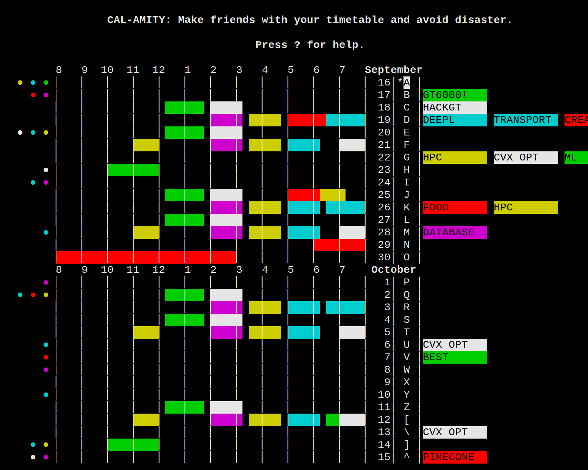

# Calamity

Calamity is a terminal-based calendar focused on fast navigation, fast data-entry, and vim-like bindings.


## Installation

Install Calamity via pip:
```
pip install calamity
```

Your calendar is stored in `~/.local/share/calamity/events.db`.

## Overview

Calamity allows you to schedule three types of events:

- **Appointments**: Events with a start and end time.
- **Tasks**: Events with a deadline, like homework.
- **Chores**: Events meant to be performed on the day they're scheduled, such as hygiene tasks.

Events are selected using a coordinate system. Days are chosen with capital letters `A-Z`, and specific events within those days are chosen with numbers `1-9`.

Events can also be repeated daily, weekly, or monthly. Repeated events generally share characteristics like description, color, and time.

## Usage

### Event Creation
- **Appointment**: `a`
- **Task**: `t`
- **Chore**: `c`

### Selecting a Day
- **Choose by letter**: `A-Z`
- **Move Down**: `j`
- **Move Up**: `k`
- **Previous Month**: `<`
- **Next Month**: `>`
- **Previous Week**: `b`
- **Next Week**: `w`
- **Jump to today**: `gg`

### Selecting an Event
- **Choose by number**: `1-9`
- **Move Right**: `l`
- **Move Left**: `h`
- **Cycle through Chores**: `TAB`
- **Cycle Appointments**: `SPC`
- **Cycle Tasks**: `RET`

### Editing an Event
- **Move Date**: `m`
- **Edit Description**: `d`
- **Edit Time (only for appointments)**: `i`
- **Edit Code (only for tasks)**: `o`
- **Cycle Color**: `;`
- **Cycle Color Backwards**: `,`
- **Delete**: `x`
- **Set Repetition**: `r`
- **Separate Event from its Repetition Group**: `s`
- **Duplicate Event**: `y`

### Miscellaneous Commands
- **Help**: `?`
- **Undo**: `u`
- **Redo**: `CTRL-R`
- **Scroll Position to Top/Middle/Bottom**: `zt`, `zz`, `zb`
- **Quit**: `ESC` or `q`

Enjoy scheduling with Calamity!
